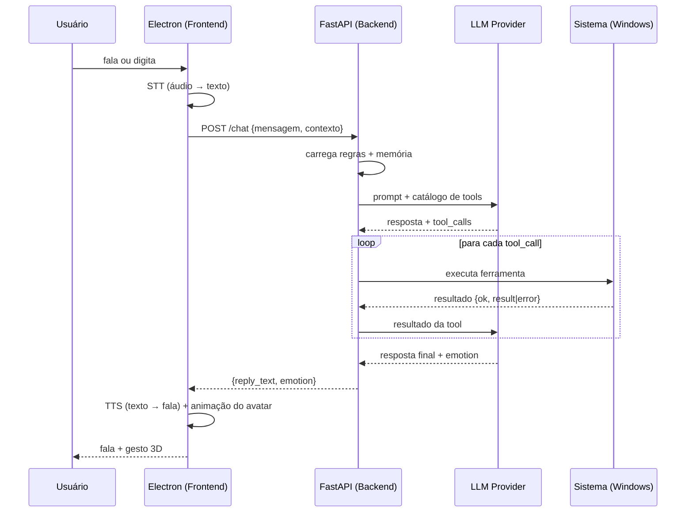
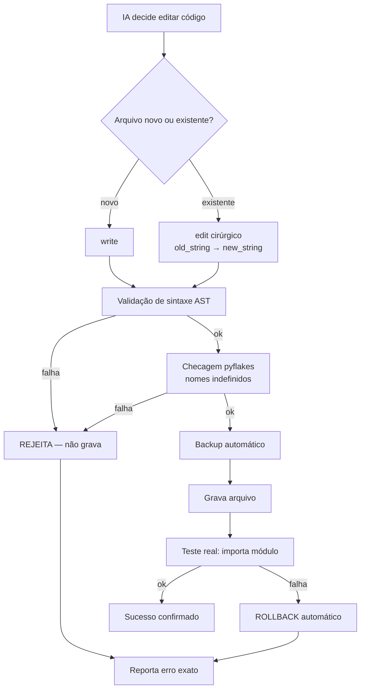
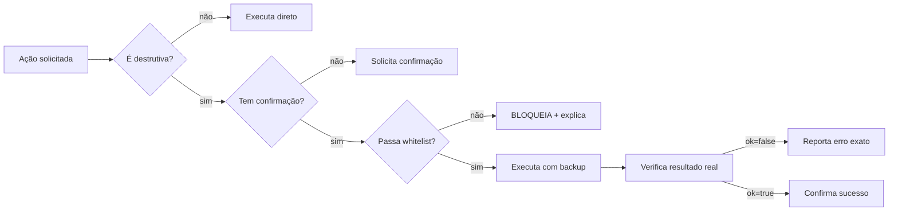
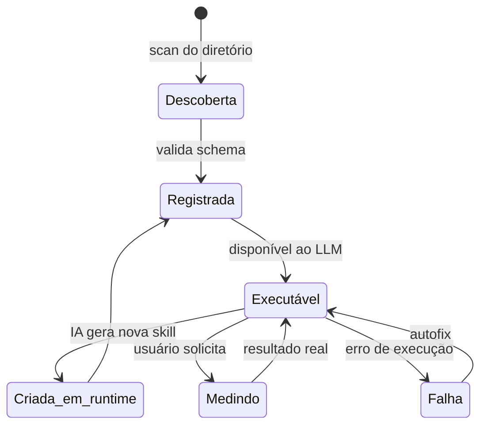

# Diagramas de Arquitetura — DIANA

## 1. Fluxo Frontend ↔ Backend

```mermaid
sequenceDiagram
    participant U as Usuário
    participant E as Electron (Frontend)
    participant F as FastAPI (Backend)
    participant L as LLM Provider
    participant S as Sistema (Windows)

    U->>E: fala ou digita
    E->>E: STT (áudio → texto)
    E->>F: POST /chat {mensagem, contexto}
    F->>F: carrega regras + memória
    F->>L: prompt + catálogo de tools
    L-->>F: resposta + tool_calls
    loop para cada tool_call
        F->>S: executa ferramenta
        S-->>F: resultado {ok, result|error}
        F->>L: resultado da tool
    end
    L-->>F: resposta final + emotion
    F-->>E: {reply_text, emotion}
    E->>E: TTS (texto → fala) + animação do avatar
    E-->>U: fala + gesto 3D
```

## 2. Pipeline de Auto-Modificação Segura

```mermaid
flowchart TD
    A[IA decide editar código] --> B{Arquivo novo ou existente?}
    B -->|novo| C[write]
    B -->|existente| D[edit cirúrgico<br/>old_string → new_string]
    C --> E[Validação de sintaxe AST]
    D --> E
    E -->|falha| R[REJEITA — não grava]
    E -->|ok| F[Checagem pyflakes<br/>nomes indefinidos]
    F -->|falha| R
    F -->|ok| G[Backup automático]
    G --> H[Grava arquivo]
    H --> I[Teste real: importa módulo]
    I -->|falha| J[ROLLBACK automático]
    I -->|ok| K[Sucesso confirmado]
    R --> L[Reporta erro exato]
    J --> L
```

## 3. Camada de Segurança de Arquivos

```mermaid
flowchart LR
    A[Ação solicitada] --> B{É destrutiva?}
    B -->|não| C[Executa direto]
    B -->|sim| D{Tem confirmação?}
    D -->|não| E[Solicita confirmação]
    D -->|sim| F{Passa whitelist?}
    F -->|não| G[BLOQUEIA + explica]
    F -->|sim| H[Executa com backup]
    H --> I[Verifica resultado real]
    I -->|ok=false| J[Reporta erro exato]
    I -->|ok=true| K[Confirma sucesso]
```

## 4. Ciclo de Vida de uma Skill

```mermaid
stateDiagram-v2
    [*] --> Descoberta: scan do diretório
    Descoberta --> Registrada: valida schema
    Registrada --> Executável: disponível ao LLM
    Executável --> Criada_em_runtime: IA gera nova skill
    Criada_em_runtime --> Registrada
    Executável --> Medindo: usuário solicita
    Medindo --> Executável: resultado real
    Executável --> Falha: erro de execução
    Falha --> Executável: autofix
```
