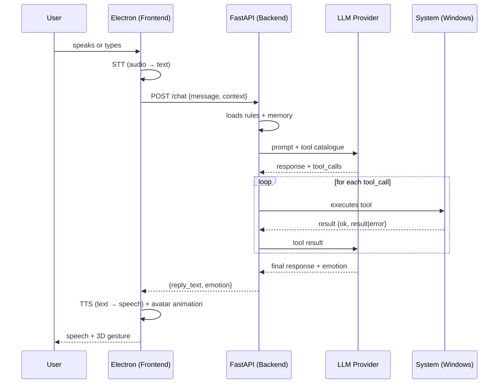
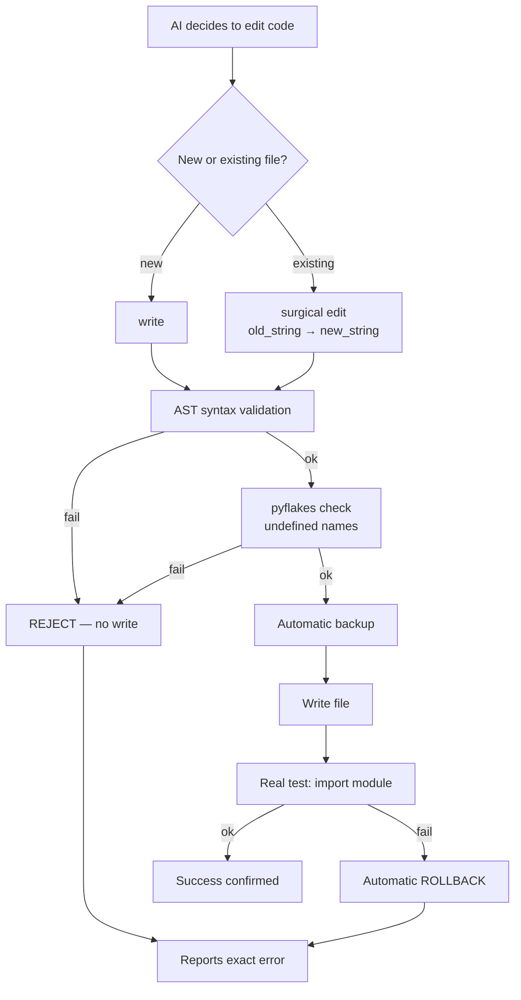
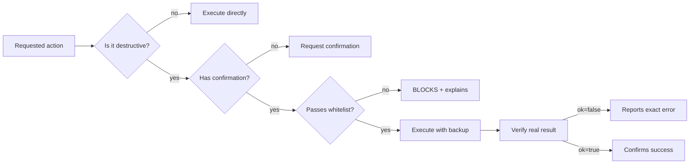
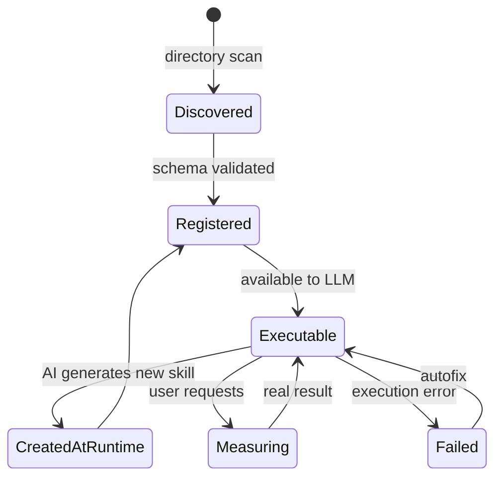

# Architecture Diagrams — DIANA

## 1. Frontend ↔ Backend Flow

```mermaid
sequenceDiagram
    participant U as User
    participant E as Electron (Frontend)
    participant F as FastAPI (Backend)
    participant L as LLM Provider
    participant S as System (Windows)

    U->>E: speaks or types
    E->>E: STT (audio → text)
    E->>F: POST /chat {message, context}
    F->>F: loads rules + memory
    F->>L: prompt + tool catalogue
    L-->>F: response + tool_calls
    loop for each tool_call
        F->>S: executes tool
        S-->>F: result {ok, result|error}
        F->>L: tool result
    end
    L-->>F: final response + emotion
    F-->>E: {reply_text, emotion}
    E->>E: TTS (text → speech) + avatar animation
    E-->>U: speech + 3D gesture
```

## 2. Safe Self-Modification Pipeline

```mermaid
flowchart TD
    A[AI decides to edit code] --> B{New or existing file?}
    B -->|new| C[write]
    B -->|existing| D[surgical edit<br/>old_string → new_string]
    C --> E[AST syntax validation]
    D --> E
    E -->|fail| R[REJECT — no write]
    E -->|ok| F[pyflakes check<br/>undefined names]
    F -->|fail| R
    F -->|ok| G[Automatic backup]
    G --> H[Write file]
    H --> I[Real test: import module]
    I -->|fail| J[Automatic ROLLBACK]
    I -->|ok| K[Success confirmed]
    R --> L[Reports exact error]
    J --> L
```

## 3. File Safety Layer

```mermaid
flowchart LR
    A[Requested action] --> B{Is it destructive?}
    B -->|no| C[Execute directly]
    B -->|yes| D{Has confirmation?}
    D -->|no| E[Request confirmation]
    D -->|yes| F{Passes whitelist?}
    F -->|no| G[BLOCKS + explains]
    F -->|yes| H[Execute with backup]
    H --> I[Verify real result]
    I -->|ok=false| J[Reports exact error]
    I -->|ok=true| K[Confirms success]
```

## 4. Skill Lifecycle

```mermaid
stateDiagram-v2
    [*] --> Discovered: directory scan
    Discovered --> Registered: schema validated
    Registered --> Executable: available to LLM
    Executable --> CreatedAtRuntime: AI generates new skill
    CreatedAtRuntime --> Registered
    Executable --> Measuring: user requests
    Measuring --> Executable: real result
    Executable --> Failed: execution error
    Failed --> Executable: autofix
```
